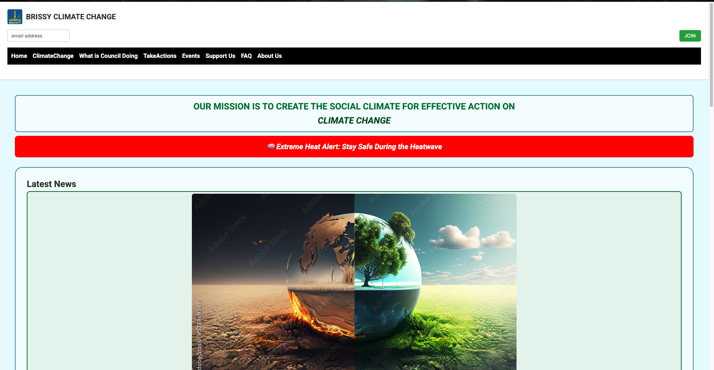
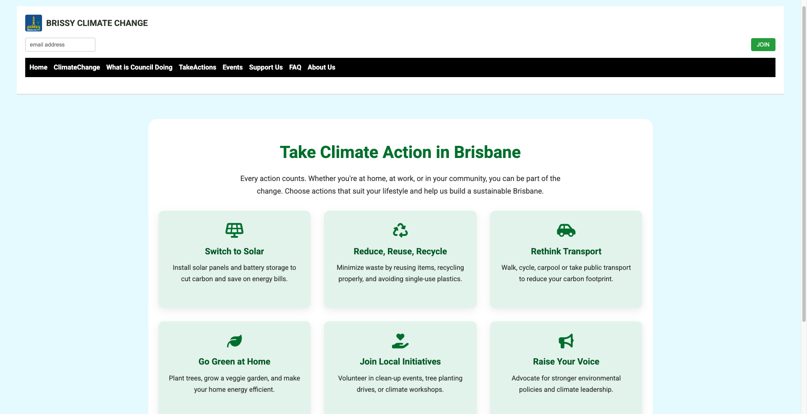
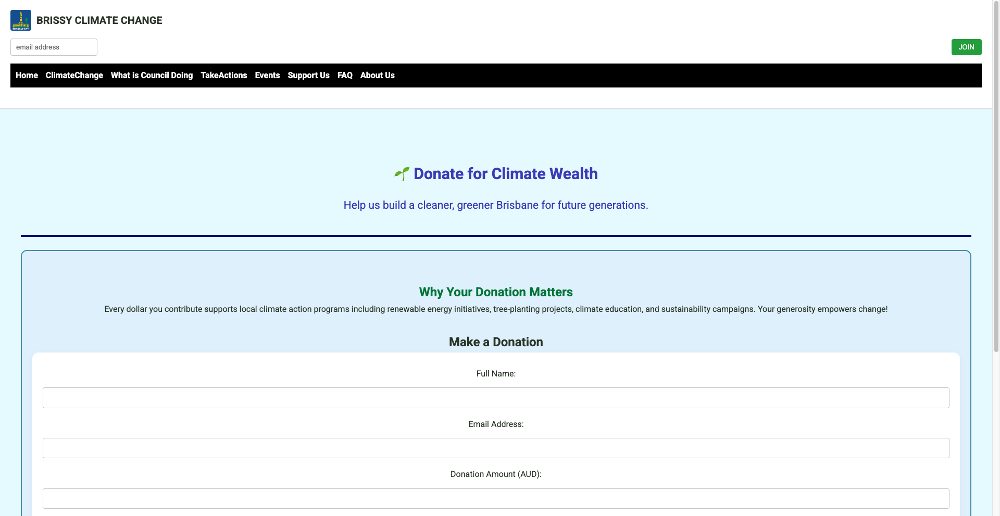

# 🌏 Brissy Climate Connect

 

> 🌿 An interactive climate change awareness website designed for Brisbane City Council — built using design thinking to inform, engage, and empower citizens to take action on environmental sustainability.

---

## 📘 Overview

**Brissy** Climate Connect is a responsive, user-centered web prototype created for the **2008ICT: Design Thinking in IT** course at Griffith University. Designed for the Brisbane City Council, the project raises local climate change awareness through engaging, accessible, and educational digital experiences.

Built using the Design Thinking methodology, the platform includes interactive features like “Take Action” tips and a donation page to promote real-world environmental involvement. It combines responsive web design, user research, and visual storytelling to inform and empower Brisbane citizens toward sustainable action.

---

## 🎯 Objectives

- Raise awareness about climate change and its local impact on Brisbane.
- Motivate community-driven action and climate-conscious behavior.
- Provide a platform for education, donations, and eco-friendly initiatives.

---

## 🛠️ Built With

- **HTML5 / CSS3**
- **JavaScript**
- **Figma** (for wireframes and prototyping)
- **Canva / Adobe XD** (for visual assets)
- **ELF framework** (for front-end logic in coursework)
- **Design Thinking** (IDEO 5-step methodology)

---

## 🧠 Methodology

The project followed a **Design Thinking** approach:

| Phase | Description |
|-------|-------------|
| **Empathize** | Researched Brisbane's climate issues and surveyed target users. |
| **Define** | Identified the need for localized, actionable climate awareness. |
| **Ideate** | Brainstormed website structure, user goals, and interactive content. |
| **Prototype** | Designed low-fidelity wireframes using Figma and paper sketches. |
| **Test** | Collected user feedback and iterated on design and content.

---

## 📸 Visuals

### 🖥️ Homepage  

### 💡 Take Action Page  

### 💸 Donate for Climate Wealth  

---

## 💻 Features

- **Responsive Design** – Optimized for desktop and mobile.
- **Modular Layout** – Easily extendable structure for future updates.
- **Call to Actions** – Sections encouraging eco-actions and donations.
- **Educational Content** – Localized facts and stats for Brisbane’s climate.
- **User Feedback Loop** – Integrated during design testing phase.

---

## 👥 Team & Roles

- **Dhruv Mehra** – UX Designer | Developer | Researcher  
  > *Led the UX ideation, built and styled the site, analyzed user feedback, and coordinated the design thinking report.*

---

## 📈 Future Improvements

- Add user authentication for contribution tracking.
- Include a forum for eco-discussion.
- Integrate live environmental data using APIs (e.g., AQI, temperature).
- Add a climate-positive store for sustainable products.

---

## 🤝 Acknowledgements

- Brisbane City Council (conceptual commissioner)
- Griffith University - 2008ICT Course Team
- Classmates for peer feedback and evaluation

---

> “We don't inherit the Earth from our ancestors, we borrow it from our children.” – Native American Proverb

